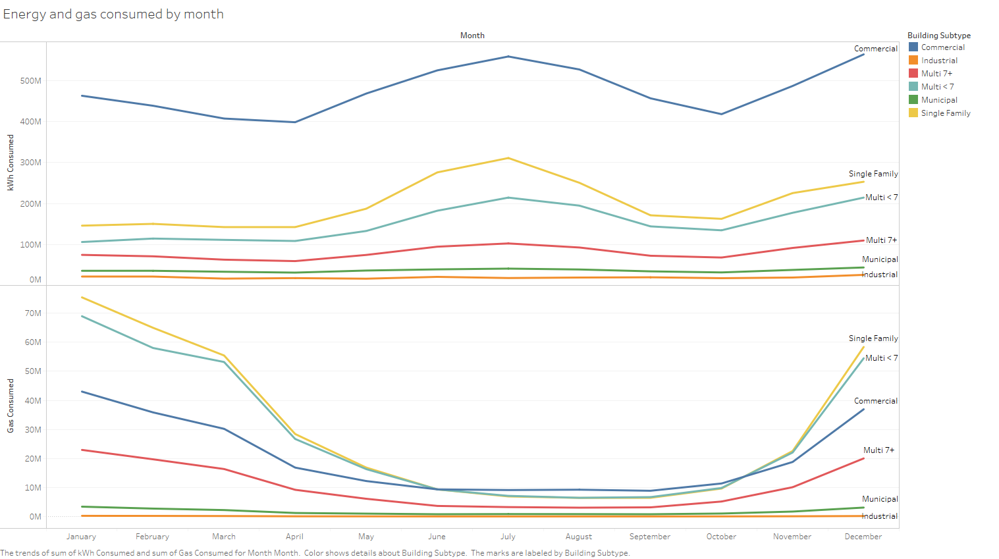
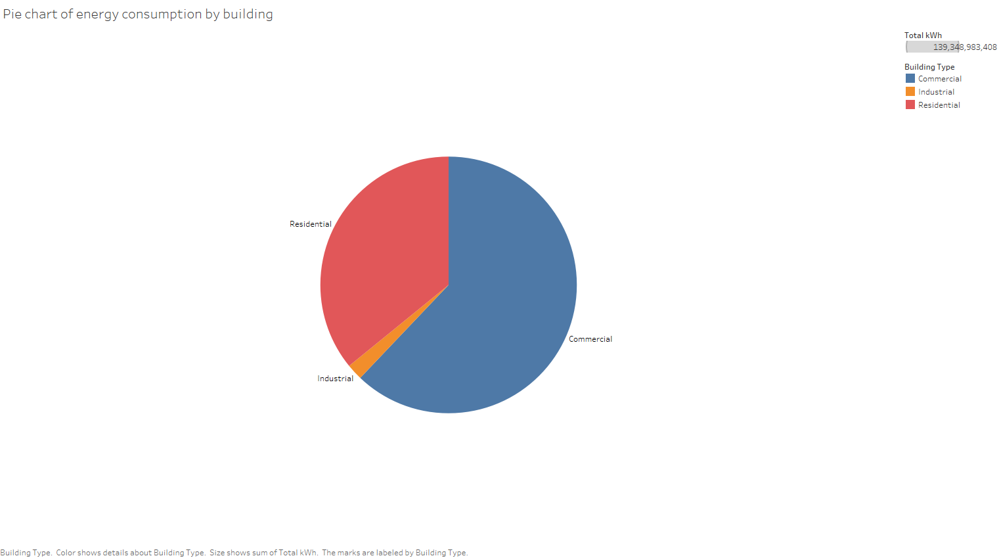

=======================================================
An exploratory data analysis of Chicago Energy Usage'10
=======================================================

The `Chicago Energy Usage 2010`_ dataset is available on Kaggle.

.. _Chicago Energy Usage 2010: https://www.kaggle.com/chicago/chicago-energy-usage-2010/

Analysis
--------

During summers, as expected, gas usage significantly decreases because people aren't burning natural gas to heat their homes and electricity usage increases because the ACs are turned on.

Clearly, the households with up to 2 individuals are the heaviest users of both electricity and gas.

Households with up to 4 individuals are using 90% of the produced energy and gas.

Buildings up to 4 stories are consuming most of the energy and gas in Chicago.

It looks like most of the population is finally moving into newer buildings (most buildings in Chicago are old) and are vacating the old buildings as electricity and gas usage of buildings newer than 40 years is quite high. An alternative explanation is that the newer buildings are simply inefficient but the former explanation seems more reasonable.

.. image:: imgs/s6.png

Gas is still involved in a lot of industries as can be seen from this graph where amount of gas used per square feet is significantly higher only for industries and doesn't follow the pattern in other parts of graph. I think that this extra gas usage is coming from heating solutions installed in the industrial buildings.

Industries and municipal buildings are the heaviest users of electricity and gas.

+------+------+
||pie1|||pie2||
+------+------+

Significant electricity consumption is in commercial applications and significant gas usage is in residential buildings.

Commercial buildings are the biggest consumers of electricity over the year.

Household buildings (single family, multi < 7) are the biggest consumers of gas over the year.

Tools used
----------

* `Python`_ 3.6 + `Pandas`_, `Jupyter`_ for data processing
* `Tableau`_ (version 2018) for graphics

.. _Python: https://www.python.org/
.. _Pandas: https://pandas.pydata.org/
.. _Jupyter: http://jupyter.org/
.. _Tableau: https://www.tableau.com/

Credits
-------

* Shreyansh Khajanchi <shreyansh_k@live.com>
